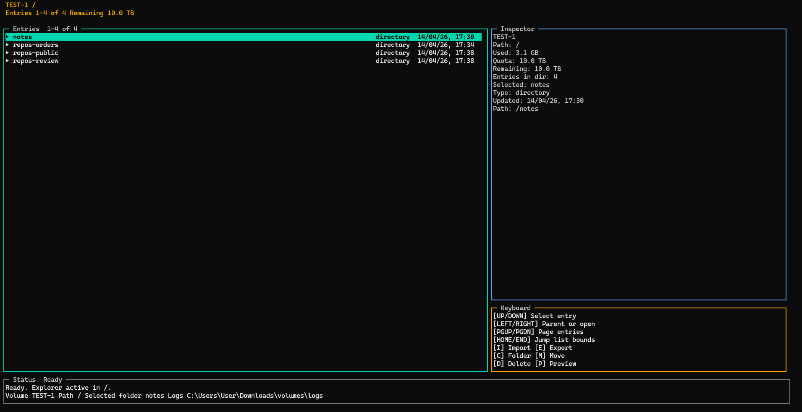

# CLI Node Virtual Volumes

<p align="center">
  <strong>Custom virtual volumes for Node.js, with a keyboard-first terminal file manager.</strong>
</p>

<p align="center">
  
  
  
  
  
</p>

<p align="center">
  
</p>

`cli-node-virtual-volumes` is a persistent, Node-only virtual filesystem designed to keep logical volumes isolated from the host OS while exposing a rich TUI and a programmable TypeScript API.

## Index

1. [Overview](#overview)
2. [Features](#features)
3. [Architecture](#architecture)
4. [Installation](#installation)
5. [Quick Start](#quick-start)
6. [Configuration](#configuration)
7. [TUI Controls](#tui-controls)
8. [Import And Export](#import-and-export)
9. [Backup, Inspect And Restore](#backup-inspect-and-restore)
10. [Node.js API](#nodejs-api)
11. [Development](#development)
12. [Packaging And Release](#packaging-and-release)
13. [Troubleshooting](#troubleshooting)
14. [Roadmap](#roadmap)
15. [License](#license)

## Overview

This project provides:

- persistent virtual volumes stored as single SQLite files
- a keyboard-first terminal file manager
- host import and export flows with integrity checks
- a Node.js API for automation and embedding
- operational commands for doctor, repair, backup, inspect, and restore

## Features

### Core Storage

- Create and delete virtual volumes.
- Configure a logical quota per volume.
- Manage folders and files in a custom virtual filesystem.
- Preview text files directly from the virtual volume.
- Persist metadata and file content in a single `.sqlite` file per volume.
- Store large file payloads in chunked SQLite blobs.
- Protect writes with revisions and transactional mutations.

### Terminal Experience

- Volume dashboard.
- Explorer for volume contents.
- Host filesystem browser for import and export.
- Prompt, confirm, preview, and help overlays.
- Inspector and status panel with progress feedback.
- Keyboard-first workflows end to end.

### Operational Tooling

- `.env`-driven configuration.
- Structured file logging.
- `doctor` with SQLite maintenance signals and safe `repair` flows.
- Consistent `backup`, `inspect-backup`, and `restore` commands.
- TypeScript build with `tsup`.
- Test suite with `vitest`.
- Cross-platform CI and release packaging.

## Architecture

The codebase is organized by responsibility:

```text
src/
  application/   -> use-case orchestration
  config/        -> runtime metadata and env validation
  domain/        -> types, DTOs, and primitives
  logging/       -> logger setup
  storage/       -> repository, blob store, sqlite integration
  ui/            -> TUI runtime and presenters
  utils/         -> general helpers
```

Main modules:

- `VolumeService`: application flows for volumes, files, import, export, and recovery.
- `VolumeRepository`: metadata persistence, transactional mutations, doctor, repair, backup, restore.
- `BlobStore`: blob persistence and integrity verification inside SQLite.
- `TerminalApp`: TUI runtime.

## Installation

Requirements:

- Node.js `>= 20`
- npm
- a terminal with TUI support

Local install:

```bash
npm install
```

Build and run:

```bash
npm run build
npm start
```

Create a tarball:

```bash
npm pack
npm install -g ./cli-node-virtual-volumes-1.1.0.tgz
```

## Quick Start

Development mode:

```bash
npm run dev
```

Basic flow:

1. Start the TUI with `virtual-volumes`.
2. Create a volume.
3. Enter the volume with `Enter` or `Right`.
4. Import files or folders from the host.
5. Navigate, preview, move, or delete entries.
6. Export data back to the host when needed.

## Configuration

The runtime reads configuration from `.env`, CLI flags, and internal defaults. A template is available in [.env.example](./.env.example).

Main variables:

| Variable | Description |
| --- | --- |
| `VOLUME_DATA_DIR` | Persistent root for virtual volumes |
| `VOLUME_AUDIT_LOG_DIR` | Optional directory for structured audit logs |
| `VOLUME_AUDIT_LOG_LEVEL` | Audit logger level, separate from the application logger |
| `VOLUME_HOST_ALLOW_PATHS` | Optional host path allowlist for import/export, separated by the OS path delimiter |
| `VOLUME_HOST_DENY_PATHS` | Optional host path denylist for import/export, separated by the OS path delimiter |
| `VOLUME_LOG_DIR` | Runtime log directory |
| `VOLUME_REDACT_SENSITIVE_DETAILS` | Redact sensitive host and local filesystem paths in logs and persisted JSON artifacts |
| `VOLUME_LOG_RETENTION_DAYS` | Optional retention window for daily app and audit log files |
| `VOLUME_SUPPORT_BUNDLE_LOG_TAIL_LINES` | Max log lines copied from the end of each app and audit log into support bundles |
| `VOLUME_DEFAULT_QUOTA_BYTES` | Default quota for new volumes |
| `VOLUME_LOG_LEVEL` | `fatal`, `error`, `warn`, `info`, `debug`, `trace`, `silent` |
| `VOLUME_LOG_TO_STDOUT` | Mirrors logs to stdout |
| `VOLUME_PREVIEW_BYTES` | Max preview size for file previews |

Operational notes:

- If `VOLUME_DATA_DIR` is not set, the runtime uses the current working directory.
- If `VOLUME_AUDIT_LOG_DIR` is not set, audit logs default to `VOLUME_LOG_DIR/audit`.
- Audit logs are written separately from application logs and capture structured success/failure events for core write, import, export, delete, backup, restore, and diagnostics operations.
- If `VOLUME_REDACT_SENSITIVE_DETAILS=true`, structured logs and persisted operational JSON artifacts redact sensitive filesystem paths while keeping local stdout output readable.
- When support bundles are generated with redaction enabled, internal JSON reports inside the bundle are sanitized too.
- If `VOLUME_LOG_RETENTION_DAYS` is set, startup prunes older daily app and audit log files automatically.
- Support bundles include bounded tail snapshots of the current app and audit logs, controlled by `VOLUME_SUPPORT_BUNDLE_LOG_TAIL_LINES`.
- Each CLI command runtime gets a correlation ID shared across app logs, audit logs, `--output` artifacts, and support bundles.
- `VOLUME_HOST_ALLOW_PATHS` and `VOLUME_HOST_DENY_PATHS` accept absolute or relative paths, resolved at startup.
- Path lists use `;` on Windows and `:` on Linux/macOS.
- If an allowlist is configured, import and export are blocked outside those roots. Denylist roots always win.
- Volumes are persisted under `VOLUME_DATA_DIR/volumes`.
- Large file contents stay inside the same SQLite database as chunked blobs.
- File logging is recommended while using the fullscreen TUI.

## TUI Controls

### Dashboard

| Key | Action |
| --- | --- |
| `Up / Down` | Change selection |
| `PageUp / PageDown` | Scroll faster |
| `Home / End` | First / last volume |
| `Right`, `Enter`, `O` | Open selected volume |
| `N` | Create volume |
| `X` | Delete selected volume |
| `R` | Refresh |
| `?` | Help |
| `Q` | Quit |

### Explorer

| Key | Action |
| --- | --- |
| `Up / Down` | Change selection |
| `PageUp / PageDown` | Page navigation |
| `Home / End` | First / last entry |
| `Right`, `Enter` | Enter folder or preview file |
| `Left`, `Backspace`, `B` | Go back |
| `C` | Create folder |
| `I` | Open import browser |
| `E` | Open export browser |
| `M` | Move / rename |
| `D` | Delete |
| `P` | Preview |
| `R` | Refresh |
| `?` | Help |

### Host Browser

| Key | Action |
| --- | --- |
| `Up / Down` | Change selection |
| `Right` | Enter folder or drive |
| `Left` | Go to parent |
| `Space` | Toggle selection in import mode |
| `A` | Toggle visible selections in import mode |
| `Enter` | Confirm import or export |
| `Esc`, `Q` | Close overlay |

## Import And Export

Import flow:

- open the import overlay with `I`
- navigate the host filesystem
- select files or folders with `Space`
- confirm with `Enter`

Export flow:

- select a file or folder in the virtual volume
- press `E`
- pick the destination host folder
- confirm the export

Both flows expose progress feedback and integrity verification.

## Backup, Inspect And Restore

The CLI exposes a full recovery workflow:

| Command | Purpose |
| --- | --- |
| `virtual-volumes backup <volumeId> <destinationPath>` | Create a consistent SQLite snapshot |
| `virtual-volumes inspect-backup <backupPath>` | Validate the backup artifact before restore |
| `virtual-volumes restore-drill <backupPath>` | Run an isolated inspect, restore, and doctor drill in a temporary sandbox |
| `virtual-volumes restore <backupPath>` | Restore a volume from backup |
| `virtual-volumes restore <backupPath> --force` | Replace an existing volume with rollback protection |
| `virtual-volumes compact <volumeId>` | Compact a managed SQLite volume and reclaim free pages |
| `virtual-volumes compact-recommended` | Compact every managed volume currently flagged by doctor for SQLite maintenance |
| `virtual-volumes repair-safe` | Auto-repair only the volumes whose current doctor findings are safe for batch automation |
| `virtual-volumes doctor [volumeId]` | Run metadata-level consistency checks after restore |
| `virtual-volumes doctor [volumeId] --verify-blobs` | Run a deeper doctor pass that hashes referenced blob payloads |
| `virtual-volumes support-bundle <destinationPath> [volumeId]` | Export doctor data, checksum inventory, runtime metadata, and log snapshot for support |
| `virtual-volumes inspect-support-bundle <bundlePath>` | Verify support bundle metadata, required files, checksums, sharing suitability, and required integrity depth |

Recommended flow:

```bash
virtual-volumes backup vol_finance_01 ./backups/finance.sqlite
virtual-volumes inspect-backup ./backups/finance.sqlite
virtual-volumes restore-drill ./backups/finance.sqlite
virtual-volumes restore ./backups/finance.sqlite
virtual-volumes compact-recommended --dry-run
virtual-volumes compact-recommended --dry-run --strict-plan
virtual-volumes compact-recommended --limit 5
virtual-volumes compact-recommended --max-reclaimable-bytes 2097152
virtual-volumes compact-recommended --min-free-bytes 1048576 --min-free-ratio 0.25
virtual-volumes compact-recommended --include-unsafe
virtual-volumes repair-safe --dry-run --verify-blobs
virtual-volumes repair-safe --limit 5 --strict-plan
virtual-volumes compact vol_finance_01
virtual-volumes doctor vol_finance_01
virtual-volumes doctor vol_finance_01 --verify-blobs
virtual-volumes support-bundle ./reports/finance-support vol_finance_01 --verify-blobs
virtual-volumes support-bundle ./reports/finance-support vol_finance_01 --backup-path ./backups/finance.sqlite
virtual-volumes inspect-support-bundle ./reports/finance-support --require-sharing internal-only --require-integrity-depth deep
```

For audit and automation, operational commands also support `--output <path>` to persist a structured JSON artifact with `command`, `cliVersion`, `correlationId`, `generatedAt`, `handling`, and `payload`, while keeping the normal CLI output on stdout.

Use `virtual-volumes support-bundle ... --no-logs` when you want the diagnostic bundle without app or audit log snapshots.

Each standard backup produces:

- a `.sqlite` file
- a `.sqlite.manifest.json` sidecar

`inspect-backup` validates:

- artifact readability
- SHA-256 checksum
- sidecar consistency
- `createdWithVersion` compatibility
- `schemaVersion` compatibility

`restore-drill` validates the recovery path end-to-end without touching live data:

- runs `inspect-backup` first
- restores the backup into an isolated temporary data directory
- runs `doctor` on the restored copy
- removes the sandbox automatically unless `--keep-sandbox` is used

`compact` runs SQLite maintenance on a managed volume:

- checkpoints and truncates the WAL
- runs `VACUUM` and `PRAGMA optimize`
- reports database artifact bytes before and after compaction

`compact-recommended` turns that into a fleet workflow:

- scans every managed volume through the same maintenance signals exposed by `doctor`
- compacts only volumes currently marked with `COMPACTION_RECOMMENDED`
- blocks unsafe volumes by default when `doctor` reports additional issues beyond compaction advice
- supports `--dry-run` to preview the plan before mutating anything
- uses dry-run output as a true fleet plan, showing `planned`, `blocked`, `filtered`, and `deferred` volumes with explicit reasons
- quantifies reclaimable bytes across `eligible`, `planned`, `blocked`, `filtered`, and `deferred` buckets so operators can size the batch before running it
- supports `--limit <n>` to process only the top N recommended volumes by reclaimable free bytes
- supports `--max-reclaimable-bytes` to cap the cumulative reclaimable-byte budget of the current batch
- supports `--min-free-bytes` and `--min-free-ratio` to tighten the batch to only the volumes that exceed explicit operator thresholds
- supports `--strict-plan` when operators or schedulers want a non-zero exit code unless the batch is fully actionable
- supports `--include-unsafe` when you intentionally want to compact even volumes that still have other doctor findings

`doctor` now also reports SQLite maintenance stats for each volume:

- database, WAL, and total artifact bytes
- free-page bytes and free-page ratio
- top compaction candidates in descending reclaimable-byte order
- fleet-wide safe-repair posture, including repairable volumes, blocked repair candidates, and top repair candidates
- blob reference-count mismatches when blob liveness metadata drifts from actual file references
- safe blob layout drifts such as `size` or `chunk_count` mismatches against the current SQLite payload layout
- `COMPACTION_RECOMMENDED` when a volume is fragmented enough to justify running `compact`
- `Integrity depth: metadata` for the fast default pass, or `Integrity depth: deep` when `--verify-blobs` is enabled

Use `virtual-volumes doctor <volumeId> --verify-blobs` when you need a slower payload scrub that re-hashes referenced blobs and catches content drift even when metadata still looks consistent.
Use `virtual-volumes doctor --fix` when you want the CLI to auto-repair safe metadata drifts like orphan blobs, manifest counters, blob reference counts, and blob layout metadata that can be recomputed from the current SQLite payload.
Use `virtual-volumes repair-safe` when you want to turn that same safe-repair logic into a fleet workflow that:

- scans all managed volumes with the same doctor depth you requested
- plans only the volumes that currently expose safe auto-repairable drifts
- blocks mixed volumes that also carry non-safe findings like missing blobs or payload corruption
- supports `--dry-run` and `--strict-plan` so schedulers can preview or gate the batch before execution
- supports `--limit <n>` to cap the current repair batch without losing visibility on deferred volumes

For the full operational procedure, drills, and audit checklist, see [docs/BACKUP-RESTORE-RUNBOOK.md](./docs/BACKUP-RESTORE-RUNBOOK.md).

Each support bundle includes:

- `manifest.json` with runtime/config metadata
- `contentProfile` in the manifest, with explicit sensitivity, sharing, retention, and disposal guidance
- `correlationId` inside the support bundle manifest for log lookup
- `doctorIntegrityDepth` in the manifest so the handoff knows whether the embedded doctor report was metadata-only or deep
- `checksums.json` with SHA-256 inventory for the generated files
- `doctor-report.json`
- `action-plan.json` with machine-readable next steps and policy-aware handoff commands
- `handoff-report.md` with operator-friendly scope, fleet posture, next actions, sharing, and retention guidance
- optional `backup-inspection.json`
- optional `backup-artifact.manifest.json` when `--backup-path` points to a manifest-backed backup
- optional current audit log tail snapshot
- optional current log tail snapshot

Use `virtual-volumes support-bundle ... --verify-blobs` when you want the embedded doctor report and handoff recommendations to be based on deep payload verification instead of the default metadata-only pass.

`inspect-support-bundle` validates:

- required metadata files
- `doctor-report.json` structure and consistency with the bundle manifest and scope
- manifest path consistency
- `contentProfile` consistency with the actual included artifacts, sharing posture, and retention policy
- `action-plan.json` structure and consistency with the bundle manifest
- `backup-inspection.json` and copied backup manifest consistency when a backup artifact is bundled
- `handoff-report.md` structure and consistency with the bundle manifest, action plan, and embedded guidance
- checksum inventory structure
- file size and SHA-256 integrity for the tracked files
- bundle sensitivity, sharing, and handling metadata so operators can see whether the artifact is external-shareable or internal-only and how long it should be retained
- retention window compliance, so stale bundles can be flagged before a handoff
- requested integrity depth, so handoff automation can require metadata-only or deep bundle verification explicitly

Use `virtual-volumes inspect-support-bundle ... --require-sharing external-shareable --require-integrity-depth deep` before an external or high-confidence handoff, or `--require-sharing internal-only --require-integrity-depth metadata` to enforce a lighter internal escalation baseline.

## Node.js API

The same runtime is available programmatically:

```ts
import { createRuntime } from 'cli-node-virtual-volumes';

const runtime = await createRuntime({
  dataDir: 'C:/cli-node-virtual-volumes/data',
  logLevel: 'info',
});

const volume = await runtime.volumeService.createVolume({
  name: 'Secure Docs',
});

await runtime.volumeService.writeTextFile(
  volume.id,
  '/hello.txt',
  'hello from the virtual filesystem',
);

const preview = await runtime.volumeService.previewFile(volume.id, '/hello.txt');
console.log(preview.content);
await runtime.close();
```

Useful API methods:

- `runtime.close()`
- `runtime.volumeService.backupVolume(...)`
- `runtime.volumeService.inspectVolumeBackup(...)`
- `runtime.volumeService.restoreVolumeBackup(...)`
- `runtime.volumeService.runDoctor(...)`
- `runtime.volumeService.runRepair(...)`
- `createSupportBundle(runtime, {...})`
- `inspectSupportBundle(bundlePath)`

## Development

Available scripts:

| Script | Description |
| --- | --- |
| `npm run dev` | Start the CLI in development |
| `npm run build` | Build the project |
| `npm start` | Run the compiled build |
| `npm run lint` | Run ESLint |
| `npm run typecheck` | Run TypeScript with no emit |
| `npm run test` | Run tests with coverage |
| `npm run smoke:ops` | Run a compiled CLI smoke for backup, inspect, restore, and doctor |
| `npm run smoke:package` | Install the local tarball and smoke the packaged library and CLI |
| `npm run verify` | Run full verification, build, and the operational smoke |
| `npm run pack:local` | Build and generate a local tarball |

The current quality bar includes:

- strict TypeScript
- layered modules by responsibility
- recovery, integrity, and rollback tests
- packaging aligned with the shipped artifact

## Packaging And Release

Generate a local package:

```bash
npm run pack:local
```

Typical release assets:

- `dist/`
- `.tgz` package artifact
- `CHANGELOG.md`
- GitHub Actions build outputs

Additional planning and maturity work is tracked in [docs/ENTERPRISE-ROADMAP.md](./docs/ENTERPRISE-ROADMAP.md).

## Troubleshooting

### The TUI flickers or gets noisy

- avoid `VOLUME_LOG_TO_STDOUT=true` while using the fullscreen UI
- use a terminal with solid escape-sequence support
- make sure you are on Node.js 20 or newer

### Import or export feels slow

- large files still need time even with progress feedback
- host disk performance has a direct impact on transfer speed

### You cannot find the volumes

- check `VOLUME_DATA_DIR`
- if it is not configured, the runtime uses the current working directory

### Restore is rejected

- run `virtual-volumes inspect-backup <backupPath>` first
- verify that the backup was not created by a newer CLI major version
- verify that `schemaVersion` and `createdWithVersion` are compatible with the current runtime
- use `--force` only when you intentionally want to overwrite an existing volume

## Roadmap

Current direction:

- continue hardening storage recovery and consistency
- keep reducing TUI monolith complexity
- improve enterprise operability and release safety
- extend automated test coverage around real failure modes

## Author

Created and maintained by **Salvatore Scarano**.

## License

This project is distributed under the [MIT](./LICENSE) license.
